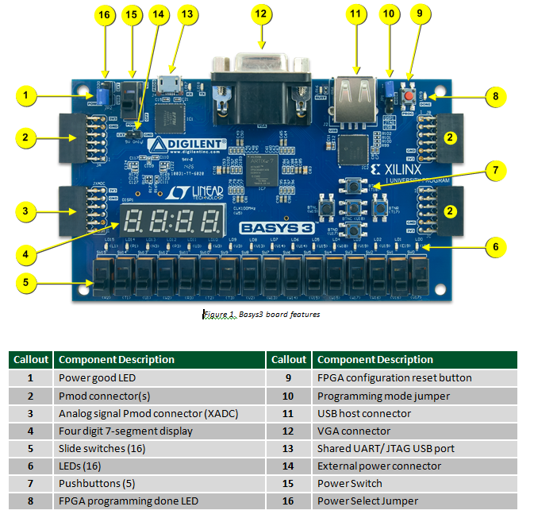

# Flip That Digit


A simple game to flip the switch corresponding to the number displayed.

## Table of Contents

1. [Project Description](#project-description)
   - [Prerequisites](#prerequisites)
   - [Installation](#installation)
2. [Getting Started](#getting-started)
3. [Usage](#usage)
4. [Contact](#contact)
5. [Acknowledgments](#acknowledgments)

## Project Description

The device is built for the interactive game “Flip That Digit.” The purpose of the game is for the user to flip the ordered switch corresponding to the number shown on the seven-segment display with a streak display, which increments with each correct response. The game runs continuously: a new, randomly generated target between zero and nine appears after each correct answer until they timeout or complete a streak of 10. The target number is the leftmost seven-segment position on the display, whereas the current streak count is the rightmost seven-segment position.

Since the score increases with every correct response, users can compete for high scores. The input is read every clock cycle of the OTTER MCU, ensuring negligible delay of valid inputs. The seven-segment display only contains four digits, so the device's output range is limited to displaying zero to nine for ease of user interaction and minimal clutter on the display. The device does not rely on external sensors, but the inputs require ten dedicated switches, and the outputs require both LEDs and the seven-segment display.

### Built With

![Assembly Badge][assembly-badge]

![SystemVerilog Badge][systemverilog-badge]

![RARS Badge][rars-badge]

![Vivado Badge][vivado-badge]

## Getting Started

### Prerequisites

- [Basys3 Board][basys3-reference-manual-url] or any programmable device
- Computer to connect
- Micro-USB cable

### Installation

1. Clone the repository

   ```git
   git clone https://github.com/BrianLiDesign/flip-that-digit.git
   ```

2. Open `main.asm` in RARS. Assemble the program and export the memory initialization file.

   ```memory
   Dump Memory To File
   ```

3. Import all the files to their respective sources in Vivado.

4. Plug the Basys3 Board into your computer using a micro-USB cable.

5. Switch the power slider (SW16 in the top left corner) to the "ON" position; the "DONE" LED will light after successful programming.

6. Open Vivado, connect to the hardware server.

7. Select the Basys3 device from the list or autoconnect and program the device with the project bitstream file (.bit).

## Usage

After programming the device with the OTTER wrapper and memory file, the game launches immediately.

1. The game will start with the target digit on the leftmost digit of the seven segment display, and the score wil be on the rightmost digit.

2. Flip the slide switch that corresponds to the displayed digit.



3. If the correct switch is flipped, the score increments by one and a new target digit is displayed; if an incorrect switch is flipped, the score remains unchanged and the same target remains until the correct switch is flipped.

4. The LED directly above the selected switch will light, and the score and target update instantly.

5. To reset the score and target, press the Basys3 power switch off and on again, or reprogram the bitstream in Vivado.

## Contact

Brian Li - <brian.li.social@gmail.com>

## Acknowledgments

- Joshua Naim, co-engineer
- Digilent - hardware and images

<!-- MARKDOWN LINKS & IMAGES -->

[assembly-badge]: https://img.shields.io/badge/assembly-assembly?style=for-the-badge&color=darkblue
[basys3-reference-manual-url]: https://digilent.com/shop/basys-3-amd-artix-7-fpga-trainer-board-recommended-for-introductory-users/
[rars-badge]: https://img.shields.io/badge/rars-rars?style=for-the-badge&color=orange
[systemverilog-badge]: https://img.shields.io/badge/systemverilog-systemverilog?style=for-the-badge&color=lightblue
[vivado-badge]: https://img.shields.io/badge/vivado-vivado?style=for-the-badge&color=white
